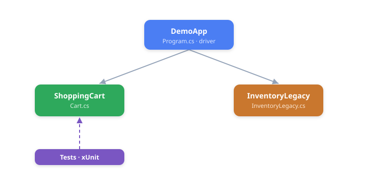

# Solution Overview — GH-300 Copilot Demo Kit (.NET 8)

This document explains what the solution is, how its pieces fit together, and where
the **intentional defects** live. The whole kit exists to give GitHub Copilot real
work to do during demos (`/fix`, `/tests`, review, refactor, modernize).

---

## 1. The big picture

There are three source projects and one test project. `DemoApp` is the entry point;
it drives the two "imperfect" library modules so their planted bugs surface at runtime.



| Project | File | Responsibility |
| --- | --- | --- |
| `DemoApp` | `Program.cs` | Console driver that runs both modules end-to-end |
| `ShoppingCart` | `Cart.cs` | Cart totals, discount, checkout |
| `InventoryLegacy` | `InventoryLegacy.cs` | SQLite-backed stock read/adjust/report |
| `ShoppingCart.Tests` | `UnitTest1.cs` | Deliberately minimal test coverage |

---

## 2. ShoppingCart module

The cart holds a list of items (price + quantity) and a discount. Checkout computes a
discounted total and returns an order.


**Planted defects (on purpose):**

- **Off-by-one bug** — `Subtotal` loops `i <= Items.Count`, so it reads one past the
  end of the list and throws `ArgumentOutOfRangeException`.
- **Leaked card number** — `Checkout` writes `user.CardNumber` to the console.
- **Money as `double`** — prices should be integer cents, not floating point.
- **Missing XML docs** on public members.

`DemoApp` wraps `Checkout` in a `try/catch` so the off-by-one surfaces as a *caught*
exception instead of crashing the walkthrough.

---

## 3. InventoryLegacy module

A SQLite-backed inventory in a deliberately dated style — no docs, no types on some
inputs, and string-built SQL.


**Planted defects (on purpose):**

- **SQL injection** — `get_stock`, `adjust`, and `bulk_import` build SQL by string
  concatenation / `string.Format` instead of using `SqliteParameter`.
- **No XML docs**, dated naming (`get_stock`, `c`, `r`, `n`).
- **Money as `double`** in `price_with_tax`.

The `stock` table has three columns: `sku`, `qty`, `reorder_point`.

---

## 4. Runtime flow (what happens on `dotnet run`)


---

## 5. How to build and run

```powershell
dotnet build
dotnet run --project src/DemoApp
dotnet test
```

---

## 6. Defect cheat sheet (Copilot demo targets)

| Where | Defect | Fix it with |
| --- | --- | --- |
| `Cart.Subtotal` | Off-by-one (`<=`) | `/fix`, inline chat |
| `Cart.Checkout` | Logs card number | Security review |
| `Cart` / `CartItem` | Money as `double` | Copilot Edits (cents) |
| `InventoryLegacy` | SQL injection | Refactor to `SqliteParameter` |
| both modules | Missing XML docs | `/doc`, modernize |
| `ShoppingCart.Tests` | Almost no tests | `/tests`, agent mode |

> Every issue above is intentional — the kit is a training ground, not production code.
